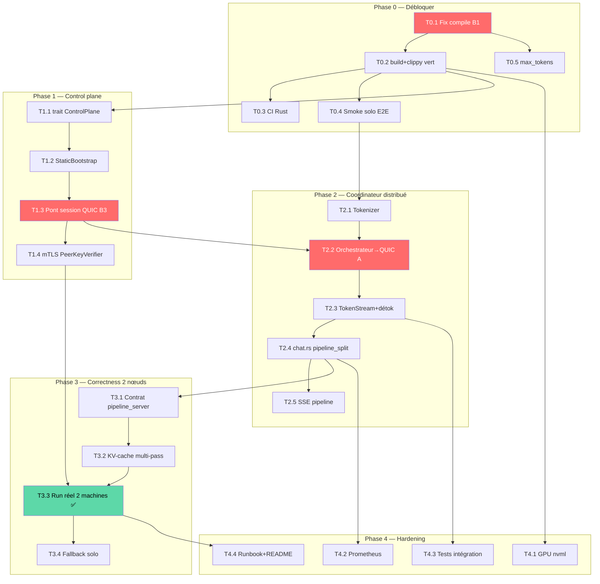

# Plan de développement — Testnet 2 nœuds (pipeline-split)

> Objectif du cycle : **inférence distribuée réelle sur 2 machines** via pipeline-split par couches.
> Statut : plan validé, aucun code modifié à ce stade.
> Date : 2026-06-25 · Auteur : coworker (PjM + Dev lens)

---

## 1. Définition de terminé (Definition of Done)

Le testnet est « vert » quand, sur **2 machines distinctes** A (coordinateur + couches basses) et B (couches hautes) :

1. `cargo build --workspace` compile sans erreur ; CI vert.
2. Un `curl` OpenAI-compatible sur le proxy de A renvoie une complétion **générée à cheval sur A et B** (vérifiable dans les logs : activations transitant en QUIC).
3. Le champ `ainonymous.execution_mode == "pipeline_split"` et `nodes_used == 2` dans la réponse.
4. La réponse est cohérente sémantiquement (détokenisation correcte côté coordinateur).
5. Fallback : si B est injoignable, A bascule en **solo** sans planter.
6. Un script `make testnet-2` (ou doc runbook) reproduit le tout.

**Hors périmètre de ce cycle** : MoE/expert-shard, redondance (NofM, SpeculativeVerify), SD-WAN réel (mock OK), warrants/anti-Sybil, UI dashboard, 3+ nœuds, bootstrap privé.

---

## 2. État réel du code (RAG) — le README est périmé

Le « Statut du projet » du README liste comme *à faire* des composants déjà écrits. État vérifié par lecture du code :

| Composant | Réalité | RAG | Note |
|---|---|---|---|
| API proxy OpenAI (`ainonymous-proxy`) | Chat blocking + SSE streaming OK (solo via llama-server) | 🟢 | Chemin **solo uniquement** |
| Types partagés (`ainonymous-types`) | API, inference, node, errors complets | 🟢 | — |
| MCP server Goose (`ainonymous-mcp`) | stdio JSON-RPC, 5 outils, complet | 🟢 | Dépend des endpoints proxy |
| QUIC transport (`ainonymous-quic`) | Listener + ActivationTransfer + TokenStream + tokens session | 🟡 | mTLS strict pas finalisé ; sessions non enregistrées |
| Daemon worker (`conductor`) | `handle_pipeline_session` (côté worker) codé | 🟡 | **Ne compile pas** (cf. B1) |
| Zomes Holochain (3 DNA) | coordinator + integrity écrits, cross-DNA call présent | 🟡 | WASM jamais buildé/testé ; pont REST factice |
| Pipeline GPU (`pipeline_server.py`) | FastAPI + transformers, prefill/decode | 🟡 | Contrat à valider end-to-end |
| **Chemin distribué côté coordinateur** | **Absent** | 🔴 | Pièce maîtresse manquante |
| Pont Holochain réel (`holochain.rs`) | POST REST vers soi-même, pas de `AppWebsocket` | 🔴 | Bloque le plan de contrôle |
| Détection GPU NVIDIA/AMD | Renvoie `CpuOnly` hors macOS | 🔴 | Bloque l'usage GPU Linux |
| Tests / CI Rust | 1 seul fichier testé ; CI = validation YAML seulement | 🔴 | Pas de garde-fou |

---

## 3. Bloqueurs & trous vérifiés dans le code

| # | Sévérité | Fichier:ligne | Problème | Impact |
|---|---|---|---|---|
| B1 | 🔴 Bloquant | `crates/ainonymous-daemon/src/main.rs:75` | `handle_pipeline_session(conn, offer, &hl)` — 3 args alors que la signature en exige **4** (`pipeline` manquant) | Le daemon ne compile pas |
| B2 | 🔴 Bloquant | `crates/ainonymous-daemon/src/holochain.rs:34-57` | `zome_call` fait un POST REST sur le daemon lui-même au lieu d'utiliser `holochain_client::AppWebsocket` | Aucun vrai plan de contrôle Holochain |
| B3 | 🔴 Bloquant | `crates/ainonymous-quic/src/listener.rs:33` + `daemon/src/main.rs:69-80` | `register_session` jamais appelé ; le signal `QuicListenerSignal` → enregistrement n'est pas câblé | Toute connexion QUIC entrante → `InvalidSessionToken` |
| B4 | 🔴 Bloquant | `proxy/src/handlers/chat.rs` (tout) | Le coordinateur ne sait faire que du solo ; pas d'init pipeline (plan → QUIC A → token stream → détok) | Pas d'inférence 2 nœuds possible |
| B5 | 🟠 Majeur | `daemon/src/conductor.rs:233` | `max_new_tokens = 512` codé en dur | Ignore `max_tokens` de la requête |
| B6 | 🟠 Majeur | `daemon/src/holochain.rs:197-211` | Détection GPU → `CpuOnly` hors macOS (pas de nvml/rocm) | Nœuds Linux annoncés sans VRAM |
| B7 | 🟠 Majeur | `conductor.rs` ↔ `pipeline_server.py` | Contrat tensoriel (dtype f16, shape, b64) non validé E2E ; détok côté coordinateur absent | Risque de sortie incohérente |
| B8 | 🟡 Mineur | `daemon/src/router.rs:79-85` | `mesh_metrics` ignore le body (`TODO`) ; params inutilisés | Métriques DHT non publiées |
| B9 | 🟡 Mineur | `proxy/handlers/models.rs:20,66` | `nodes_available` figé à 1, download non déclenché | Cosmétique pour le testnet |

---

## 4. Décision d'architecture à trancher (clé du cycle)

**Plan de contrôle pour le testnet : Holochain réel vs bootstrap statique.**

| Option | Pour | Contre | Reco |
|---|---|---|---|
| **A. Bootstrap statique** (liste de pairs + token via config/CLI, Holochain désactivé) | Découple le testnet du risque Holochain ; livrable en jours ; teste QUIC + pipeline isolément | Ne valide pas le DHT ; dette à reprendre | ✅ **Recommandé pour ce cycle** |
| B. Holochain réel (`AppWebsocket`, hApp buildée, signals) | Valide l'architecture cible complète | Build WASM + intégration `holochain_client` = semaines ; risque élevé | Cycle suivant |

> **Recommandation** : viser le DoD 2 nœuds via **bootstrap statique** (un `ControlPlane` trait avec impl `StaticBootstrap` + impl `Holochain` stub). On prouve le data plane (QUIC + pipeline) d'abord, on branche Holochain ensuite sans réécrire le data plane. Ce choix conditionne tout le reste du plan ci-dessous.

---

## 5. Backlog priorisé (work breakdown)

Tailles T-shirt : XS ≈ <0.5j · S ≈ 0.5–1j · M ≈ 2–4j · L ≈ 1–2 sem.

### Phase 0 — Débloquer & fondations solo (garantir le « toujours vert »)

| ID | Tâche | Taille | Dépend de | DoD |
|---|---|---|---|---|
| T0.1 | Corriger B1 : passer `&conductor.pipeline` à `handle_pipeline_session` | XS | — | `cargo build -p ainonymous-daemon` OK |
| T0.2 | `cargo build --workspace` + `cargo clippy` vert ; nettoyer warnings (B8) | S | T0.1 | 0 erreur, 0 warning bloquant |
| T0.3 | CI GitHub Actions : ajouter job `cargo build/test/clippy` Rust | S | T0.2 | CI rouge→vert sur PR |
| T0.4 | Smoke test E2E solo : proxy → llama-server (script + assertion) | S | T0.2 | `curl` renvoie complétion, test auto |
| T0.5 | Brancher `max_tokens` requête → conductor (B5) | XS | T0.1 | plus de constante 512 |

### Phase 1 — Plan de contrôle bootstrap + pont QUIC

| ID | Tâche | Taille | Dépend de | DoD |
|---|---|---|---|---|
| T1.1 | Définir trait `ControlPlane` (get_plan, negotiate_session, announce) | S | T0.2 | trait + types, impl vide compile |
| T1.2 | Impl `StaticBootstrap` : pairs + endpoints + token depuis config TOML | M | T1.1 | 2 daemons se « voient » via config |
| T1.3 | Câbler enregistrement de session QUIC (B3) : négociation → `register_session` | M | T1.2 | connexion QUIC entrante authentifiée OK |
| T1.4 | Finaliser mTLS `PeerKeyVerifier` ed25519 (ou mode `insecure-testnet` documenté) | M | T1.3 | handshake mutuel OK ou flag explicite |

### Phase 2 — Chemin d'inférence distribuée côté coordinateur (cœur)

| ID | Tâche | Taille | Dépend de | DoD |
|---|---|---|---|---|
| T2.1 | Tokenizer côté coordinateur (prompt → token_ids) | S | T0.4 | IDs corrects vs référence HF |
| T2.2 | Orchestrateur coordinateur : plan → QUIC nœud A → envoi token_ids | M | T1.3, T2.1 | activations partent vers A |
| T2.3 | Réception `TokenStream` + détokenisation incrémentale (B7) | M | T2.2 | texte reconstruit côté coordinateur |
| T2.4 | Brancher dans `chat.rs` : mode `pipeline_split` si plan multi-nœuds, sinon solo | M | T2.3 | `execution_mode` correct dans la réponse |
| T2.5 | SSE streaming en mode pipeline (re-émettre tokens du mesh) | M | T2.4 | streaming 2 nœuds fonctionnel |

### Phase 3 — Correctness pipeline 2 nœuds réels

| ID | Tâche | Taille | Dépend de | DoD |
|---|---|---|---|---|
| T3.1 | Valider contrat `pipeline_server.py` ↔ conductor (dtype, shape, b64) sur 1 machine, 2 process | M | T2.4 | hidden states A→B cohérents |
| T3.2 | KV-cache : prefill/decode multi-passes, `/clear` ; vérifier indices couches | M | T3.1 | génération >1 token stable |
| T3.3 | Run réel 2 machines (modèle léger : `gemma4-e4b` ou e2b) | M | T3.2, T1.4 | DoD §1 atteint |
| T3.4 | Fallback solo si nœud suivant injoignable (B4 robustesse) | S | T3.3 | coupure de B → A répond solo |

### Phase 4 — Hardening, observabilité, démo

| ID | Tâche | Taille | Dépend de | DoD |
|---|---|---|---|---|
| T4.1 | Détection GPU NVIDIA (nvml) + AMD optionnel (B6) | M | T0.2 | VRAM réelle annoncée sur Linux |
| T4.2 | Métriques Prometheus `:9338` (latence, tok/s, nœuds, sauts pipeline) (B8) | S | T2.4 | scrape OK |
| T4.3 | Tests d'intégration QUIC + pipeline (mock pipeline_server) | M | T2.3 | CI couvre le data plane |
| T4.4 | Runbook `make testnet-2` + MAJ statut README | S | T3.3 | repro en <15 min |

---

## 6. Chemin critique

```
T0.1 → T0.2 → T1.1 → T1.2 → T1.3 → T2.2 → T2.3 → T2.4 → T3.1 → T3.2 → T3.3 ✅
```

Tâches **hors chemin critique** (parallélisables) : T0.3/T0.4/T0.5, T1.4 (sauf si mTLS exigé avant run), T2.1, T4.1, T4.2, T4.3. T1.4 et T3.3 convergent : le run réel exige le handshake.

Estimation chemin critique : ~**3 à 4 semaines** pour 1 dev (≈ 1 XS + 1 S + 6 M + buffer). Avec un 2e dev sur Phase 4 + tests en parallèle : ~2,5 semaines calendaires.

---

## 7. Diagramme de dépendances



---

## 8. Risques & mitigations

| Risque | P | Impact | RAG | Mitigation |
|---|---|---|---|---|
| Contrat tensoriel A↔B incohérent (dtype/endianness/shape) | Haute | Sortie corrompue | 🔴 | T3.1 d'abord sur 1 machine/2 process ; figer f16 LE + tests de round-trip |
| `holochain_client` instable / build WASM long | Haute | Dérapage planning | 🟠 | Bootstrap statique (option A §4) ; Holochain reporté |
| mTLS ed25519 ↔ certif TLS non trivial avec quinn 0.11 | Moyenne | Blocage run réel | 🟠 | Flag `insecure-testnet` documenté en repli ; finaliser hors chemin critique |
| Détok incrémentale (espaces, tokens partiels) buggée | Moyenne | Texte illisible | 🟠 | Réutiliser tokenizer HF côté coordinateur ; tests sur prompts connus |
| Pas de garde-fou (tests quasi nuls) → régressions | Haute | Re-cassage | 🟠 | T0.3 + T4.3 tôt ; bloquer merge si CI rouge |
| VRAM Linux mal détectée → mauvais scheduling | Moyenne | Plan inadapté | 🟡 | T4.1 ; en attendant, VRAM via config manuelle |
| Dérive de périmètre (MoE, redondance, UI) | Moyenne | Retard DoD | 🟡 | Hors périmètre §1 explicite ; backlog séparé |

---

## 9. Lens Dev — questions ouvertes à lever

1. **Tokenisation** : côté coordinateur (Rust `tokenizers`) ou déléguée à `pipeline_server.py` via `/tokenize` ? (impacte T2.1). *Reco : déléguer au pipeline_server pour garantir l'alignement modèle.*
2. **mTLS** : exigé pour le testnet, ou flag `insecure-testnet` acceptable en v1 ? (impacte T1.4 / chemin critique).
3. **Modèle de démo** : `gemma4-e2b`/`e4b` (léger, CPU-friendly) confirmé pour réduire les besoins matériels des 2 machines ?
4. **2 machines** : réelles (2 PC/VPS) ou 2 conteneurs/2 process en loopback pour la CI ? (T3.1 vs T3.3).
5. **Legacy `hybridnode-*`** : ces crates (hors workspace) sont-ils maintenus ou à archiver ? Ils créent une ambiguïté avec `ainonymous-*`.

---

## 10. Prochaine action recommandée

Démarrer **T0.1 + T0.2** (débloquer la compilation, <0.5j) — sans valeur conditionnelle, prérequis de tout le reste — puis trancher la décision §4 (bootstrap statique) avant d'attaquer la Phase 1.
