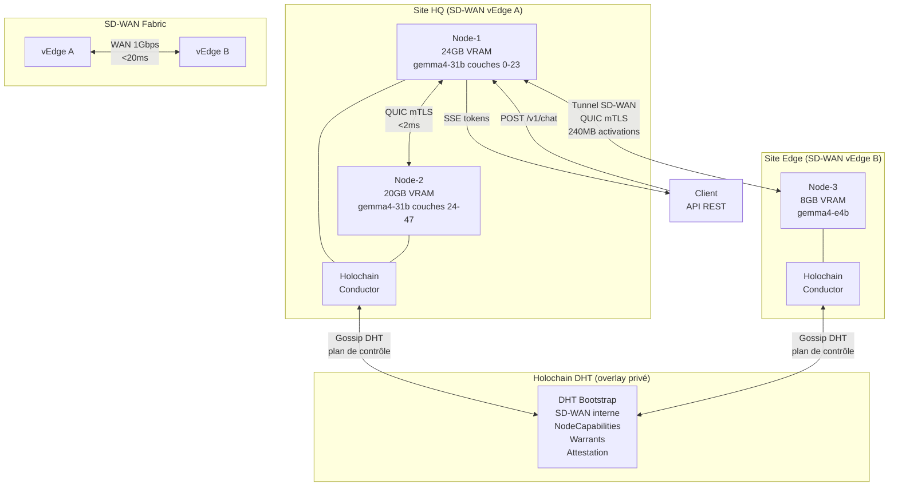

# HybridNode — Architecture Détaillée

> Flux de données, décisions de routage et interactions entre SD-WAN, Holochain et QUIC/mTLS.

---

## Flux d'une Requête HybridNode

```
CLIENT
  │ POST /v1/chat/completions {model: "gemma4-31b"}
  ▼
PROXY LOCAL (ainonymous-proxy :9337)
  │
  ▼
HYBRIDNODE SCHEDULER (hybridnode-core)
  │
  ├─── 1. Requête SD-WAN : get_site_topology() + get_link_sla()
  │         → SiteTopology{sites: [HQ, Edge], links: [{HQ↔Edge: 1Gbps/18ms}]}
  │
  ├─── 2. Requête Holochain : query_available_nodes("gemma4-31b")
  │         → [Node-1{site:HQ, 24GB}, Node-2{site:HQ, 20GB}, Node-3{site:Edge, 8GB}]
  │
  ├─── 3. Décision de scheduling (LocalFirst)
  │         → Node-1 + Node-2 (même site HQ, latence < 2ms)
  │         → Plan: PipelineSplit{A: couches 0-23, B: couches 24-47}
  │
  ▼
PLAN DE CONTRÔLE (Holochain)
  │ call_remote(Node-2, "negotiate_quic_session", {layer_range: 24-47})
  │◄── {quic_addr: "10.0.1.42:54xxx", session_token: [32B]}
  │
  ▼
PLAN DE DONNÉES (QUIC/mTLS via tunnel SD-WAN)
  │ Node-1 ──QUIC mTLS──► Node-2 (activations couches 0-23, ~120MB)
  │ Node-2 ──QUIC mTLS──► Node-1 (tokens générés, SSE stream)
  │
  ▼
POST-INFÉRENCE (Holochain)
  │ publish_metrics() → DHT
  │ SD-WAN : update traffic stats pour cette session
  ▼
CLIENT (SSE stream de tokens)
```

---

## Composants HybridNode

### hybridnode-core (Rust)

```
src/
├── lib.rs            — re-exports publics
├── config.rs         — HybridNodeConfig (YAML/TOML)
├── identity.rs       — pont clé ed25519 Holochain ↔ certificat SD-WAN
├── topology.rs       — SiteTopology, LinkSla, SiteId
├── sdwan.rs          — trait SdwanProvider + implémentations (REST API, mock)
├── scheduler.rs      — SchedulingContext, SchedulingStrategy, ExecutionPlan
├── model.rs          — ModelPlacementPolicy, réplication GGUF
├── observability.rs  — métriques hybrides (SD-WAN + Holochain)
└── error.rs          — HybridNodeError
```

### hybridnode-daemon (Rust)

```
src/
└── main.rs           — daemon qui charge hybridnode.yaml et orchestre les composants
```

### dnas/hybridnode (Holochain DNA)

```
dnas/hybridnode-core/
├── zomes/integrity/  — entrées HybridNode : SiteAnnouncement, LinkMetrics
└── zomes/coordinator/— API : announce_site, get_network_topology, publish_link_metrics
```

---

## Diagramme Mermaid



---

## Politiques et Configuration

### hybridnode.yaml (spec principale)

```yaml
version: "1.0"
mode: hybridnode

identity:
  backend: holochain          # utilise la clé ed25519 Holochain comme identité principale
  keystore: lair              # lair-keystore (Holochain standard)

holochain:
  conductor_url: "ws://localhost:8888"
  app_port: 8889
  version: "0.6.1"
  bootstrap_mode: private
  bootstrap_url: "https://bootstrap.internal.sdwan:8888"

sdwan:
  provider: rest              # "rest" | "vmanage" | "velocloud" | "mock"
  api_url: "https://vmanage.internal:8443"
  api_token_env: SDWAN_API_TOKEN
  site_id_env: SDWAN_SITE_ID
  poll_interval_seconds: 30

quic:
  mtls_strict: true
  bind_addr: "0.0.0.0:0"
  relay_fallback: true
  dscp_marking: 46             # EF — Expedited Forwarding pour QoS SD-WAN

scheduler:
  default_strategy: local_first
  activation_size_limit_mb: 512
  inter_site_latency_budget_ms: 100
  intra_site_latency_budget_ms: 10

models:
  placement_strategy: locality_aware
  max_inter_site_activation_mb: 50  # au-delà → modèle léger ou refus pipeline-split

inference:
  llama_server_port: 9337
  api_port: 9337
  metrics_port: 9338

observability:
  prometheus: true
  otel_endpoint: ""             # vide = désactivé
  sdwan_metrics: true           # inclure métriques SD-WAN dans les snapshots DHT
```

---

## Sécurité HybridNode

```
Identité unique par nœud :
  ed25519 Holochain = AgentPubKey = certificat QUIC mTLS = identité SD-WAN (optionnel)

Double chiffrement en inter-sites :
  Tunnel SD-WAN (IPsec/TLS 1.3) → chiffrement WAN niveau 3/4
  QUIC mTLS ed25519           → chiffrement applicatif niveau données

Résultat :
  Un observateur sur le WAN voit des tunnels IPsec SD-WAN chiffrés
  À l'intérieur des tunnels : du QUIC mTLS ed25519
  → Double confidentialité, même pour un insider réseau
```

---

## Réutilisation dans d'Autres Projets

HybridNode est **indépendant d'AInonymous** — la couche `hybridnode-core` ne dépend pas d'`ainonymous-*`.

Exemple d'intégration dans un autre projet :

```toml
# Cargo.toml d'un autre projet
[dependencies]
hybridnode-core = { path = "../AInonymous/crates/hybridnode-core" }
# ou via git :
hybridnode-core = { git = "https://github.com/Geoking2104/AInonymous", tag = "hybridnode-v1.0" }
```

```rust
// Intégration minimale
use hybridnode_core::{HybridNodeConfig, Scheduler, SdwanProvider};

let config = HybridNodeConfig::from_file("hybridnode.yaml")?;
let sdwan = config.build_sdwan_provider().await?;
let scheduler = Scheduler::new(config.scheduler, sdwan);

let plan = scheduler.schedule(&request, &available_nodes).await?;
```

Voir `hybridnode/configs/generic-project.hybridnode.yaml` pour un template de configuration vierge.
