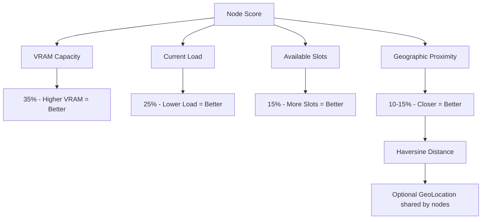

# Système de Scoring des Nœuds (Optimisé)

## Vue d'ensemble

Le scoring permet au coordinateur de choisir les meilleurs nœuds pour exécuter des parties d'inférence de manière intelligente et géographiquement consciente.

## Facteurs de scoring



## Formule de scoring

```text
score = (vram_gb / 24.0) * 35
      + (1.0 - load) * 25
      + (available_slots / 8.0) * 15
      + geographic_proximity_score()
```

## Proximité géographique (Haversine)

Si les nœuds partagent leurs coordonnées (`latitude` / `longitude`) :

- Calcul de la distance réelle en kilomètres
- Score inversement proportionnel à la distance
- Bonus si le nœud partage sa position

## Avantages

- Équilibré entre capacité et disponibilité
- Prend en compte la latence réseau via la géographie
- Extensible (on peut ajouter fiabilité historique, etc.)
- Cache + filtrage pour performance

## Exemple de nœuds classés

| Nœud     | VRAM | Load | Slots | Distance | Score  | Rang |
|----------|------|------|-------|----------|--------|------|
| node-eu1 | 24GB | 0.2  | 6     | 120 km   | 92     | 1    |
| node-us1 | 32GB | 0.6  | 3     | 7800 km  | 78     | 2    |
| node-as1 | 16GB | 0.1  | 7     | 9200 km  | 71     | 3    |
```